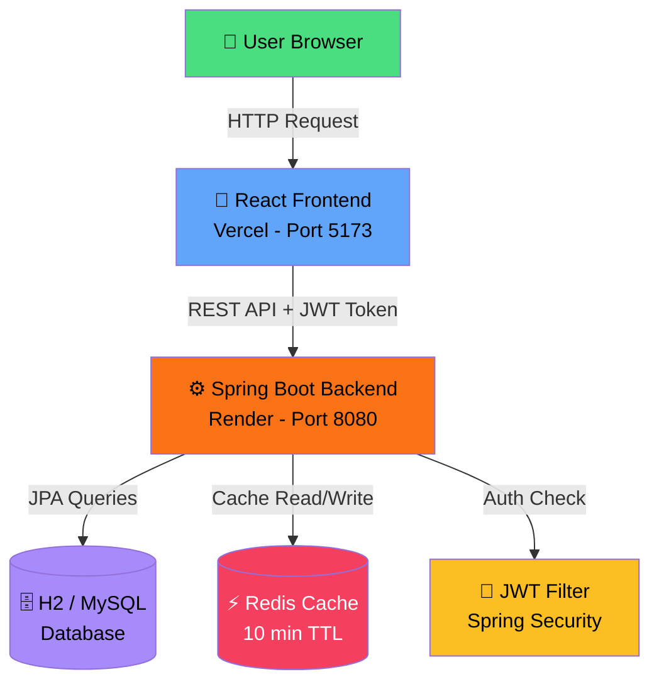

# 🛒 SmartStore — Full Stack E-Commerce Application

## 🌐 Live Demo

| Service | URL |
|---------|-----|
| 🎨 Frontend | [smart-store-green.vercel.app](https://smart-store-green.vercel.app) |
| ⚙️ Backend API | [smartstore-backend-chg3.onrender.com](https://smartstore-backend-chg3.onrender.com) |

> ⚠️ Backend is on Render free tier — may take 30–60 seconds to wake up on first visit.

---

## 📌 About

SmartStore is a production-grade full-stack e-commerce web application built completely from scratch. It features JWT authentication, product catalog with search and filtering, shopping cart with GST calculation, order management, and Redis caching for performance.

Built to demonstrate real-world software development skills — REST API design, database modelling, React UI, security implementation, Docker containerization and cloud deployment.

---

## 🚀 Tech Stack

### Frontend
| Tech | Use |
|------|-----|
| React 18 + Vite | UI & build tool |
| React Router v6 | Page navigation |
| Axios | API calls |
| Tailwind CSS | Styling |
| Context API | Auth + Cart state |

### Backend
| Tech | Use |
|------|-----|
| Spring Boot 3.2 | REST API |
| Java 21 | Core language |
| Spring Security + JWT | Authentication |
| Spring Data JPA | Database ORM |
| H2 Database | In-memory DB |
| Redis | Product caching |
| Lombok | Clean code |
| Docker | Containerization |

### Deployment
| Platform | Purpose |
|----------|---------|
| Vercel | Frontend hosting |
| Render | Backend hosting |
| GitHub | Version control |

---

## ✨ Features

- 🔐 **JWT Authentication** — Register, Login, Logout
- 🛍️ **Product Catalog** — 16 products, 5 categories, search and filter
- 🛒 **Shopping Cart** — Add, remove, update qty, persists on refresh
- 💰 **GST Calculation** — 18% tax, free shipping above ₹499
- 📦 **Order Management** — Place orders, view history with status
- ⚡ **Redis Caching** — Faster product API responses
- 🔒 **Role Based Access** — ADMIN manages products, USER shops
- 📱 **Responsive UI** — Works on mobile and desktop

---

## 🏗️ Architecture



---

## 📡 API Endpoints

### Auth
| Method | Endpoint | Description |
|--------|----------|-------------|
| POST | `/api/auth/register` | Create new account |
| POST | `/api/auth/login` | Login → returns JWT token |

### Products
| Method | Endpoint | Description |
|--------|----------|-------------|
| GET | `/api/products` | All products (Redis cached) |
| GET | `/api/products/{id}` | Single product |
| GET | `/api/products/search?name=` | Search by name |
| POST | `/api/products` | Create product (ADMIN only) |
| PUT | `/api/products/{id}` | Update product (ADMIN only) |
| DELETE | `/api/products/{id}` | Delete product (ADMIN only) |

### Orders
| Method | Endpoint | Description |
|--------|----------|-------------|
| POST | `/api/orders` | Place new order |
| GET | `/api/orders/user/{id}` | Get order history |

---

## 💻 Run Locally

### Prerequisites
- Java 21+
- Node.js 18+
- Maven

### Steps

```bash
# 1. Clone the repo
git clone https://github.com/swayamkatole/SmartStore.git
cd SmartStore

# 2. Start Backend (auto seeds 16 products on first run)
cd Backend
./mvnw spring-boot:run
# Runs at http://localhost:8080

# 3. Start Frontend (open new terminal)
cd frontend
npm install
npm run dev
# Runs at http://localhost:5173
```

### Demo Credentials
| Role | Email | Password |
|------|-------|----------|
| Admin | admin@smartstore.com | admin123 |
| User | user@smartstore.com | user123 |

---

## 📁 Project Structure

SmartStore/
├── Backend/
│ ├── src/main/java/com/smartstore/backend/
│ │ ├── controller/
│ │ │ ├── AuthController.java
│ │ │ ├── ProductController.java
│ │ │ └── OrderController.java
│ │ ├── model/
│ │ │ ├── User.java
│ │ │ ├── Product.java
│ │ │ ├── Order.java
│ │ │ └── Category.java
│ │ ├── repository/
│ │ ├── security/
│ │ │ ├── JwtUtil.java
│ │ │ └── JwtFilter.java
│ │ ├── service/
│ │ ├── dto/
│ │ ├── SecurityConfig.java
│ │ ├── DataInitializer.java
│ │ └── BackendApplication.java
│ ├── Dockerfile
│ └── pom.xml
│
└── frontend/
└── src/
├── pages/
│ ├── HomePage.jsx
│ ├── LoginPage.jsx
│ ├── RegisterPage.jsx
│ ├── ProductDetailPage.jsx
│ ├── CartPage.jsx
│ └── OrdersPage.jsx
├── components/
│ ├── Navbar.jsx
│ └── ProductCard.jsx
├── context/
│ ├── AuthContext.jsx
│ └── CartContext.jsx
├── services/
│ └── api.js
└── App.jsx


---

## 🎯 Key Technical Decisions

| Decision | Reason |
|----------|--------|
| JWT over Sessions | Stateless auth scales better — no server-side session storage |
| Context API over Redux | Sufficient for this scale, avoids unnecessary boilerplate |
| H2 for dev, MySQL-ready | Zero setup locally, JPA schema is MySQL-compatible |
| Docker on Render | Render free tier has no Java support — Docker gives full control |
| Redis caching | Product catalog rarely changes — reduces DB load significantly |

---

## 👨‍💻 Author

**Swayam Katole**
- 🐙 GitHub: [@swayamkatole](https://github.com/swayamkatole)
- 🌐 Live Project: [smart-store-green.vercel.app](https://smart-store-green.vercel.app)

---

⭐ **Star this repo if you found it useful!**
